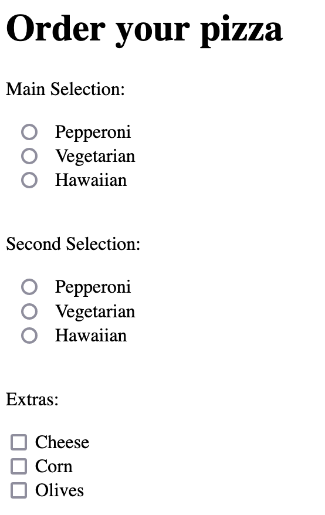

<!-- classes: title -->

# Making impossible states with TypeScript and fp-ts in a React Application

---

# Who am I?

Cristhian Motoche


Software Developer @ Stack Builders

<!-- block-start: grid -->
<!-- account: twitter, camm_v222 -->
<!-- account: github, CristhianMotoche -->
<!-- block-end -->

---

## Things I like from Haskell/Elm:

- Strong and Static Typed Languages

- Functional Programming

---

## TypeScript

```ts
type UUID = string

type Role = "admin" | "author" | "reader"

type Comic = { title: string }

interface User {
  name: string
  role: Role
}

type Either<L, R> = Left<L> | Right<R>

interface Left<T> {
  left: T
  tag: 'Left'
}

interface Right<R> {
  right: R
  tag: 'Right'
}

// Types from values, type indexing, etc...
```

---

## fp-ts - Types!

```ts
type Option<A> = None | Some<A>

type Either<E, A> = Left<E> | Right<A>

export type NonEmptyArray<A> = Array<A> & {
  0: A
}

// Async Operations:
interface Task<A> {
  (): Promise<A>
}

interface TaskEither<E, A> extends Task<Either<E, A>> {}

// Set, Records, Transformers, etc.
```
---

## fp-ts - Helpers!

```ts
// pipe to apply reversed function application
pipe(
   users,
   findFirst((x) => x.role === 'author'),
   fold(
      () => <p>{'Cannot write in here'}<p>,
      (x) => <p>{`${x.name} is an author`}<p>,
   ),
)
```
---

## fp-ts - Type classes and Type instances!

```ts
// Type class represented by an interface
interface Eq<T> {
  equals: (a: T, b: T) => boolean;
}

// Type instances
const userEq: Eq<User> = {
  equals: (a, b) => a.name === b.name && a.role === b.role;
}

// Ord, Semigroup, Monoid, Functor, Applicative, Alternative,
// Monad, Bifunctor, etc...
```

---

## Making impossible states impossible

[Making impossible states impossible - Elm](https://www.youtube.com/watch?v=IcgmSRJHu_8)

By Richard Feldman


---

## Making impossible states impossible

The purpose is to:

> Get compile errors to avoid undesired states

---

For example, a form to order a pizza:



---

```ts
interface PizzaOrder {
  mainIngredient: Option<Ingredient>
  secondIngredient: Option<Ingredient>
  extras: Array<Extra>
}
```

allows for these type of scenarios:

```ts
const order: PizzaOrder = {
  mainIngredient: O.none,
  secondIngredient: O.none,
  extras: ['meat'],
}
// ^^ Don't have type but include extras?
```
---

## Making impossible states impossible

What about this?

```ts
interface PizzaOrder {
  mainIngredient: Option<{
    main: Ingredient
    extras: Array<Extra>
  }>
  secondIngredient: Option<Ingredient>
}
```

It allows:

```ts
const order: PizzaOrder = {
  mainIngredient: O.none,
  secondIngredient: O.some('vegetarian'),
}
```

---

## Making impossible states impossible

How about this?

```ts
type PizzaOrder = NoMainIngredient | SelectedMain

type NoMainIngredient = {
  tag: 'NoMainIngredient'
}

type SelectedMain = {
  selection: {
    main: Ingredient
    second: Option<Ingredient>
  }
  extras: Array<Extra>
  tag: 'SelectedMain'
}
```

---

## Define smart constructors, functions, and type instances for it:

```ts

export const noIngredient: PizzaOrder = { tag: 'NoMainIngredient' }

export const mkSelection: PizzaOrder = (main: Ingredient) => {
  selection: {
    main,
    second: O.none,
  },
  extras: [],
  tag: 'SelectedMain',
}

export const getPrice = (order: PizzaOrder): number => { ... };

export const pizzaOrderEq: Eq<PizzaOrder> {
  equals: (poA: PizzaOrder, poB: PizzaOrder) => { ... }
}
```

---

## Use hooks that work for these types:

Use [fp-ts-react-stable-hooks](https://github.com/mblink/fp-ts-react-stable-hooks):

```ts
// useStable -> useState
// useStableEffect -> useEffect
// useStableMemo -> useMemo
// useStableCallback -> useCallback

const [pizzaOrder, setPizzaOrder] = useStable(
  noIngredient,
  Eq.tuple(pizzaOrderEq),
)

useStableEffect(
   () => { ... },
   [pizzaOrder],
   Eq.tuple(pizzaOrderEq),
)
```

---

## Thanks!
